# AI-DLC Adaptive Workflow Overview

**Purpose**: Technical reference for AI model and developers to understand complete workflow structure.

**Note**: Similar content exists in welcome-message.md (user welcome message) and README.md (documentation). This duplication is INTENTIONAL - each file serves a different purpose:
- **This file**: Detailed technical reference with Mermaid diagram for AI model context loading
- **welcome-message.md**: User-facing welcome message with ASCII diagram
- **README.md**: Human-readable documentation for repository

## The Five-Phase Lifecycle:
• **INCEPTION PHASE**: Planning and architecture (Workspace Detection + conditional phases + Workflow Planning)
• **DESIGN PHASE**: Detailed technical design per unit (Functional Design, NFR Design, Infrastructure Design)
• **CONSTRUCTION PHASE**: Code generation (Code Generation per unit)
• **QUALITY ASSURANCE PHASE**: Build verification, testing, and QA testing plan generation with interactive results collection
• **DOCUMENTATION PHASE** (CONDITIONAL): Technical docs under Technical Docs → `<application-name>`; user-facing docs under User Docs

## The Adaptive Workflow:
• **Workspace Detection** (always) → **Reverse Engineering** (brownfield only) → **Requirements Analysis** (always, adaptive depth) → **Conditional Phases** (as needed) → **Workflow Planning** (always) → **Code Generation** (always, per-unit) → **Build and Test** (always) → **QA Testing Plan** (always)

## How It Works:
• **AI analyzes** your request, workspace, and complexity to determine which stages are needed
• **These stages always execute**: Workspace Detection, Requirements Analysis (adaptive depth), Workflow Planning, Code Generation (per-unit), Build and Test, QA Testing Plan, QA Test Samples
• **All other stages are conditional**: Reverse Engineering, User Stories, Application Design, Units Generation, per-unit design stages (Functional Design, NFR Requirements, NFR Design, Infrastructure Design)
• **No fixed sequences**: Stages execute in the order that makes sense for your specific task

## Your Team's Role:
• **Answer questions** in dedicated question files using [Answer]: tags with letter choices (A, B, C, D, E)
• **Option E available**: Choose "Other" and describe your custom response if provided options don't match
• **Work as a team** to review and approve each phase before proceeding
• **Collectively decide** on architectural approach when needed
• **Important**: This is a team effort - involve relevant stakeholders for each phase

## AI-DLC Five-Phase Workflow:

```mermaid
flowchart TD
    Start(["User Request"])
    
    subgraph INCEPTION["🔵 INCEPTION PHASE"]
        WD["Workspace Detection<br/><b>ALWAYS</b>"]
        RE["Reverse Engineering<br/><b>CONDITIONAL</b>"]
        RA["Requirements Analysis<br/><b>ALWAYS</b>"]
        Stories["User Stories<br/><b>CONDITIONAL</b>"]
        WP["Workflow Planning<br/><b>ALWAYS</b>"]
        AppDesign["Application Design<br/><b>CONDITIONAL</b>"]
        UnitsG["Units Generation<br/><b>CONDITIONAL</b>"]
    end
    
    subgraph DESIGN["🔵 DESIGN PHASE"]
        FD["Functional Design<br/><b>CONDITIONAL</b>"]
        NFRD["NFR Design<br/><b>CONDITIONAL</b>"]
        ID["Infrastructure Design<br/><b>CONDITIONAL</b>"]
    end
    
    subgraph CONSTRUCTION["🟢 CONSTRUCTION PHASE"]
        CG["Code Generation<br/><b>ALWAYS</b>"]
    end
    
    subgraph QUALITYASSURANCE["🟣 QUALITY ASSURANCE PHASE"]
        BT["Build and Test<br/><b>ALWAYS</b>"]
        QA["QA Testing Plan<br/><b>ALWAYS</b>"]
        TS["QA Test Samples<br/><b>ALWAYS</b>"]
    end
    
    subgraph DOCUMENTATION["📄 DOCUMENTATION PHASE"]
        DOC["Documentation<br/><b>CONDITIONAL</b>"]
    end
    
    Start --> WD
    WD -.-> RE
    WD --> RA
    RE --> RA
    
    RA -.-> Stories
    RA --> WP
    Stories --> WP
    
    WP -.-> AppDesign
    WP -.-> UnitsG
    AppDesign -.-> UnitsG
    UnitsG --> FD
    FD -.-> NFRD
    NFRD -.-> ID
    
    ID --> CG
    FD --> CG
    NFRD --> CG
    CG -.->|Next Unit| FD
    CG --> BT
    BT --> QA
    QA --> TS
    TS -.-> DOC
    TS --> End(["Complete"])
    DOC --> End
    
    style WD fill:#4CAF50,stroke:#1B5E20,stroke-width:3px,color:#fff
    style RA fill:#4CAF50,stroke:#1B5E20,stroke-width:3px,color:#fff
    style WP fill:#4CAF50,stroke:#1B5E20,stroke-width:3px,color:#fff
    style CG fill:#4CAF50,stroke:#1B5E20,stroke-width:3px,color:#fff
    style BT fill:#4CAF50,stroke:#1B5E20,stroke-width:3px,color:#fff
    style QA fill:#4CAF50,stroke:#1B5E20,stroke-width:3px,color:#fff
    style TS fill:#4CAF50,stroke:#1B5E20,stroke-width:3px,color:#fff
    style RE fill:#FFA726,stroke:#E65100,stroke-width:3px,stroke-dasharray: 5 5,color:#000
    style Stories fill:#FFA726,stroke:#E65100,stroke-width:3px,stroke-dasharray: 5 5,color:#000
    style AppDesign fill:#FFA726,stroke:#E65100,stroke-width:3px,stroke-dasharray: 5 5,color:#000
    style UnitsG fill:#FFA726,stroke:#E65100,stroke-width:3px,stroke-dasharray: 5 5,color:#000
    style FD fill:#FFA726,stroke:#E65100,stroke-width:3px,stroke-dasharray: 5 5,color:#000
    style NFRD fill:#FFA726,stroke:#E65100,stroke-width:3px,stroke-dasharray: 5 5,color:#000
    style ID fill:#FFA726,stroke:#E65100,stroke-width:3px,stroke-dasharray: 5 5,color:#000
    style INCEPTION fill:#BBDEFB,stroke:#1565C0,stroke-width:3px, color:#000
    style DESIGN fill:#B3E5FC,stroke:#0277BD,stroke-width:3px, color:#000
    style CONSTRUCTION fill:#C8E6C9,stroke:#2E7D32,stroke-width:3px, color:#000
    style QUALITYASSURANCE fill:#E1BEE7,stroke:#6A1B9A,stroke-width:3px, color:#000
    style DOCUMENTATION fill:#FFF9C4,stroke:#F57F17,stroke-width:3px, color:#000
    style DOC fill:#FFA726,stroke:#E65100,stroke-width:3px,stroke-dasharray: 5 5,color:#000
    style Start fill:#CE93D8,stroke:#6A1B9A,stroke-width:3px,color:#000
    style End fill:#CE93D8,stroke:#6A1B9A,stroke-width:3px,color:#000
    
    linkStyle default stroke:#333,stroke-width:2px
```

**Stage Descriptions:**

**🔵 INCEPTION PHASE** - Planning and Architecture
- Workspace Detection: Analyze workspace state and project type (ALWAYS)
- Reverse Engineering: Analyze existing codebase (CONDITIONAL - Brownfield only)
- Requirements Analysis: Gather and validate requirements (ALWAYS - Adaptive depth)
- User Stories: Create user stories and personas (CONDITIONAL)
- Workflow Planning: Create execution plan (ALWAYS)
- Application Design: High-level component identification and service layer design (CONDITIONAL)
- Units Generation: Decompose into units of work (CONDITIONAL)

**🔵 DESIGN PHASE** - Detailed Technical Design (per unit)
- Functional Design: Detailed business logic design per unit (CONDITIONAL, per-unit)
- NFR Design: Non-functional requirements and design patterns (CONDITIONAL, per-unit)
- Infrastructure Design: Map to actual infrastructure services (CONDITIONAL, per-unit)

**🟢 CONSTRUCTION PHASE** - Code Generation
- Code Generation: Generate code with Part 1 - Planning, Part 2 - Generation (ALWAYS, per-unit)

**🟣 QUALITY ASSURANCE PHASE** - Build Verification and Manual Testing
- Build and Test: Build all units and execute comprehensive testing (ALWAYS)
- QA Testing Plan: Generate testing plan for user to execute in dev/prod environment (ALWAYS)
- QA Test Samples: Generate concrete test data and sample payloads for each test scenario (ALWAYS)
- Interactive results collection and posting to Git issue (link with summary)

**📄 DOCUMENTATION PHASE** - Technical and User-Facing Documentation (CONDITIONAL)
- Documentation: Generate documentation stored under Technical Docs → `<application-name>` in Google drive (CONDITIONAL — user opts in after QA)

**Key Principles:**
- Phases execute only when they add value
- Each phase independently evaluated
- INCEPTION focuses on "what" and "why"
- DESIGN focuses on "how" (per unit)
- CONSTRUCTION focuses on "build"
- QUALITY ASSURANCE focuses on "verify" — build verification, testing, and user verification in a real environment
- DOCUMENTATION focuses on "document" — optional, user opts in after QA (stored under Technical Docs)
- Simple changes may skip conditional INCEPTION stages
- Complex changes get full INCEPTION and CONSTRUCTION treatment